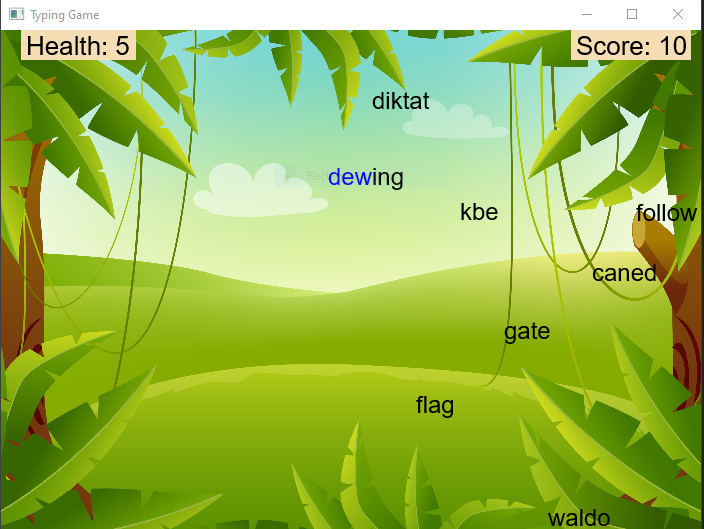

# Typing Game
Uses Java and the JavaFX module to create a typing game designed for beginner typists aiming to improve their typing skills.
# Note:
This project was created using Eclipse and requires the JavaFX jar files to be added to the build path in order to be run. The .txt file has not been thoroughly checked for appropriate language and can easily be substituted for one of similar format.
# Demo:

  

